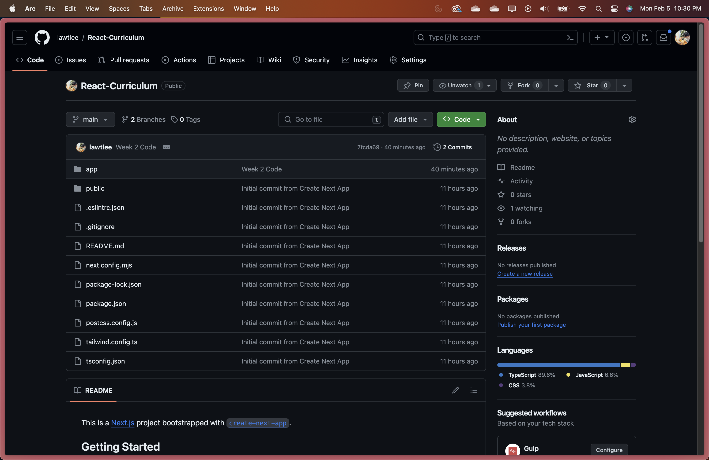
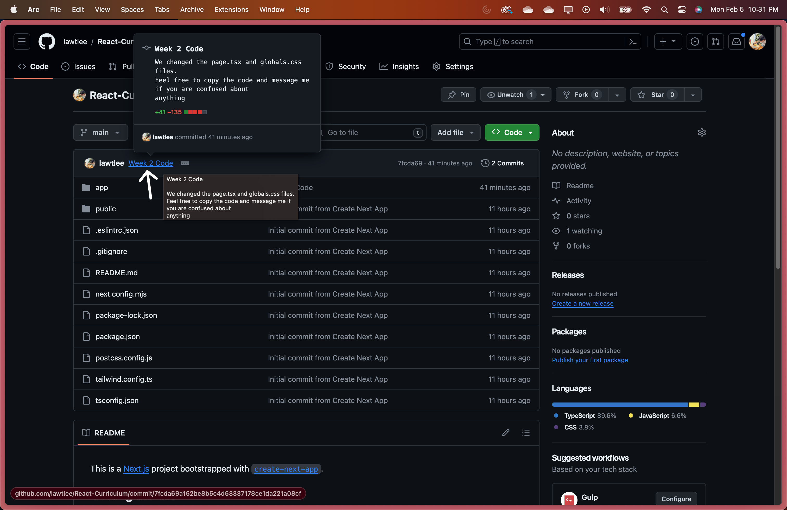
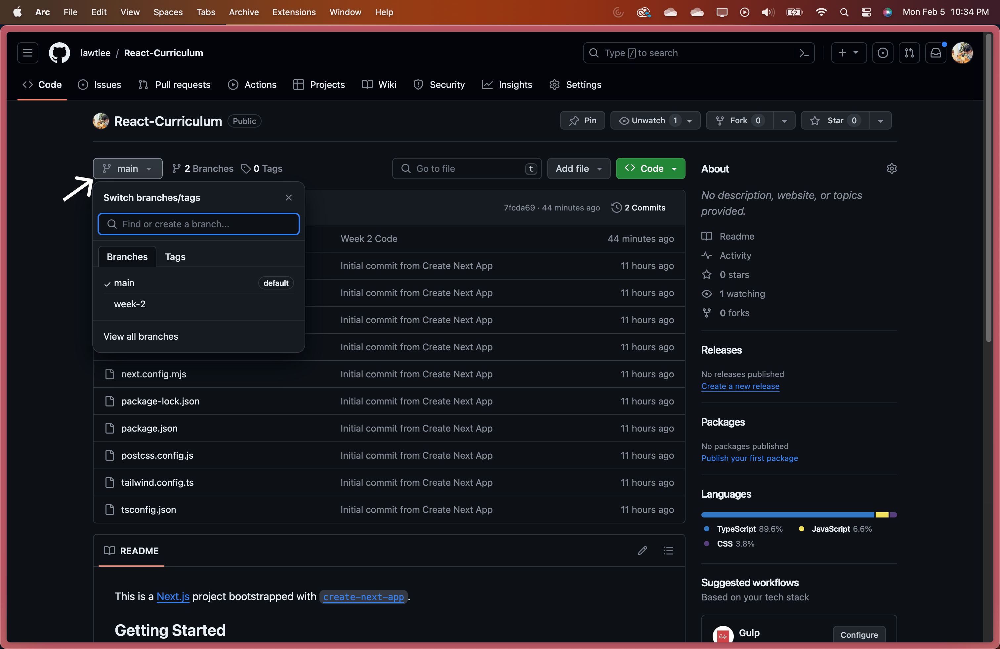
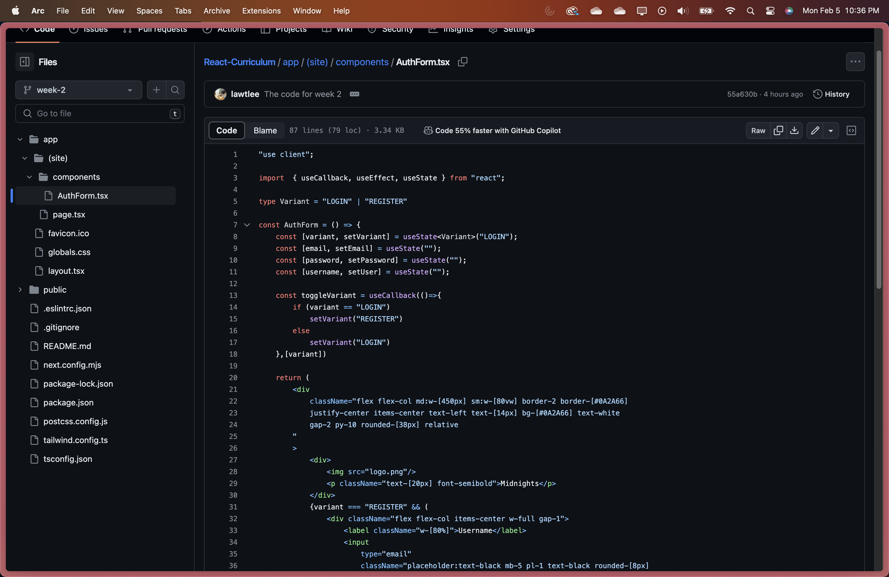

This is a guide on how to navigate the github repository and how I will be styling it to make it easy for you guys to see what has been changed. This is the link to the github repository: https://github.com/lawtlee/React-Curriculum.

1. You can go visit the link above and it should look something like this.

1. Now the main branch/this page should have contain the code that we go over every week. If you hover over the line next to my github username you should get something like this.

This is a commit message and the message will tell you what files have been changed. In this case you see that ***page.tsx*** and ***globals.css*** have been changed. The message should also contain a little more detail about what went on. That kinda depends on how much information I decide to put in the snippet.
So you can navigate the folder system and find the files that are changed and copy the code there and that will be where we are.

1. The next part is how to look at branches. If you click on this you should see several options starting with main and eventually different weeks.

If you then click on the week that we're on or the week that you want to look at. You will get brought to a page that contains different code. Since this is written in week 2. If you navigate to the file system you will see what I plan to do each week. Basically the progress I hope to get done each week. For example I planned to write this much code for Week 2.

This resource is very helpful if you want to take a peak ahead to what we are going to do or if you're just curious where we are in comparison to where I think we should be. 

That is pretty much how I will be using this github repository, PLEASE Note that the main branch (The link that you visit) will be changing every week. Also the branch will be updated pretty soon after the meeting so you can quickly see the changes and additions to the code.